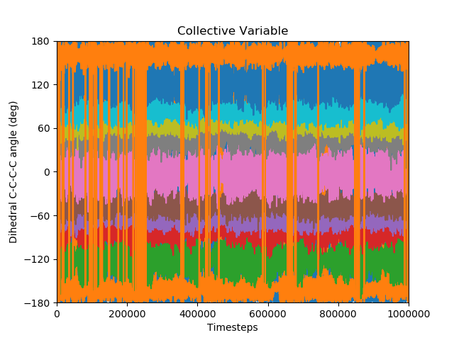
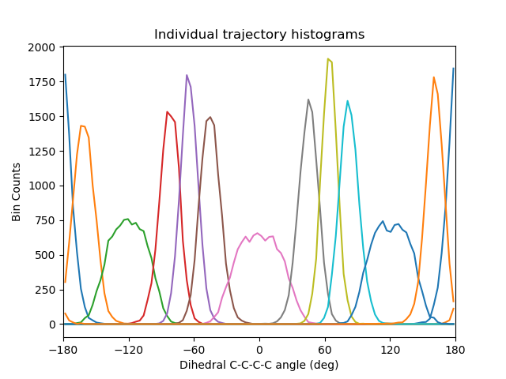
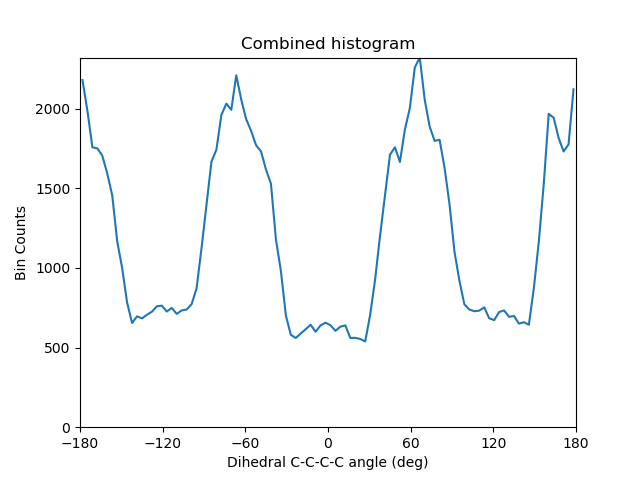
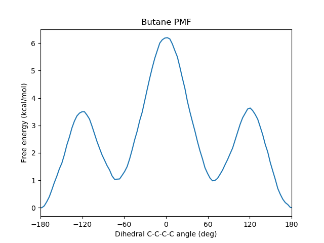

This folder contains sample outputs from the SSAGES HOOMD-blue Umbrella Sampling example code.

`cv_vs_time.png` plots the collective variable (dihedral angle) over time. This helps check that enough autocorrelation times have passed.

`histogram_trajectories.png` shows a histogram from each of the trajectories and the regions of the CV that were sampled.

`histogram_combined.png` shows a histogram summed over all trajectories to ensure that the entire range of angles were sampled.

`wham_free_energy.png` is the free energy as a function of the dihedral angle.

