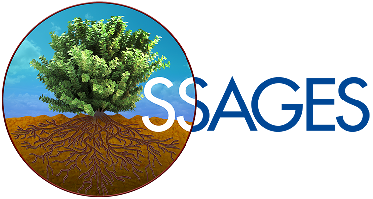

<div align="center">
  <a href="http://ssagesproject.github.io" target="_blank">
    
  </a>
</div>

<h2 align="center">
<p align="center">
  <a href="http://ssagesproject.github.io/docs/index.html" target="_blank">
    
  </a>
  &nbsp;
  <a href="https://doi.org/10.1063/1.5008853" target="_blank">
    
  </a>
</p>
</h2>

**SSAGES** (**S**oftware **S**uite for **A**dvanced **G**eneral **E**nsemble
**S**imulations) is an open-source, engine agnostic, C++11 based advanced
sampling package.  It is designed to be easy to use, extendable and extremely
versatile. It is currently pre-beta, meaning that there are many rough edges,
but we are working rapidly to expand its features and fix any bugs. Keep an eye
on this page for future updates and see below on how to contribute!

## What's New (v0.10.0)
-

To view the full changelog history, refer to [HISTORY](HISTORY.md).

<a id="features"></a>
## Features
**SSAGES** currently works with multiple molecular dynamics engines. It contains a variety of collective variables (CVs) and advanced sampling methods.

### Highlights
- Engine agnostic framework
- Simple JSON input file syntax
- Easy to add new CVs
- Easy to add new methods
- Much more!

### Engines
- GROMACS 5.1.x, 2016.x, 2018.x
- LAMMPS (Most recent versions)
- OpenMD (2.5+)
- QBox (1.63+)

### CVs
- Artificial Neural Network (as a function of group positions)
- Atom group coordinate
- Atom group position
- Atom group separation
- Bend angle
- Box volume
- Components of gyration tensor
- Pairwise kernel (coordination number, nearest neighbors)
- Polymer Rouse modes
- Root-mean-square deviation (RMSD)
- Secondary structure (alpha, anti/parallel beta sheet) RMSD
- Torsional angle

### Methods
- Adaptive biasing force
- Artificial neural network sampling
- Basis function sampling
- Combined Force–Frequency Sampling
- Metadynamics
- Umbrella sampling
- Finite temperature string
- Nudged elastic band
- Swarm of trajectories
- Forward flux sampling

<a id="installation"></a>
## Installation
The first step is to clone the repository locally.

```bash
$ git clone https://github.com/MICCoM/SSAGES-public.git
```
**SSAGES** uses a CMake build system. It also requires the use of a support MD engine.
For example, to compile with LAMMPS, execute the following

```bash
$ cd SSAGES
$ mkdir build && cd build
$ cmake -DLAMMPS_SRC=/path/to/lammps/src ..
$ make
```

This will build a SSAGES executable which will reside in the build directory.

If you want to use a specific compiler (or if your default compiler is not supported),
set the C and C++ compilers with `CMAKE_C_COMPILER` and `CMAKE_CXX_COMPILER`, respectively.
For example, to use gcc/g++, replace the CMake command with

```bash
$ cmake -DLAMMPS_SRC=/path/to/lammps/src -DCMAKE_C_COMPILER=gcc -DCMAKE_CXX_COMPILER=g++ ..
```

If you want to compile and run unit and integration tests, replace the cmake command
in the example above with

```bash
$ cmake -DLAMMPS_SRC=/path/to/lammps/src -DBUILD_TESTS=ON ..
```

### MPI

A requisite underlying MPI library also required to run SSAGES.
On recent Debian based systems using OpenMPI, the requirement
can be installed via:

```bash
$ sudo apt-get install libopenmpi-dev openmpi-bin
```

For more detail on the build system, please check the documentation.

To build the documentation, refer to [Documentation README](doc/README.md).

## Known issues
**SSAGES** is currently in pre-beta. That means there may be known issues that are not yet resolved. Major issues are listed here.

- Restarts are not fully functioning for all methods.

## Contributing
Feel free to fork this project on GitHub. Any pull-requests, feature requests or other form of contributions are welcome.
