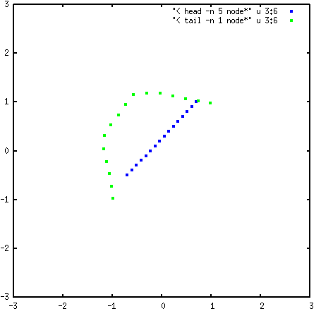

.. _Finite-temperature-string:

Finite Temperature String
-------------------------

Introduction
^^^^^^^^^^^^

Along with Nudged Elastic Band and Swarm of Trajectories, Finite Temperature
String Method (FTS) is a chain-of-states method. As in other chain-of-states
methods, multiple copies of a system are simulated, with each copy ("image")
corresponding to a different state of the system along some proposed transition
pathway. In FTS, each image is associated with a node along a smooth curve
through in collective variable space, representing a transition pathway. 

The goal of FTS is to evolve the path of this smooth curve or "string" until it
approximates a transition pathway by finding the **principal curve**, which by
definition intersects each of the perpendicular hyperplanes that it passes
through at the expected value of each hyperplane. As such, a principal curve is
often referred to as being its own expectation. Rather than sampling along each
hyperplane belonging to each node along the string, we use the Voronoi
approximation introduced by Vanden-Eijnden and Venturoli in 2009 [1]_. We
associate each node along the string with a corresponding Voronoi cell,
consisting of the region in state space where any point is closer to its origin
node than any other node along the string. Each image is free to explore within
the bounds of its associated Voronoi cell. To evolve the string toward its own
expectation, the string is evolved toward the running averages in CV space for
each image along the string.

The evolution of the string can be broken down into the following steps:

1. Evolve the individual images with some dynamics scheme, using the location of
   the initial image as a starting point. Only keep the new update at each time
   step if it falls within the Voronoi cell of its associated image; if the
   updated position leaves the Voronoi cell, the system is returned back to the
   state at the previous timestep. 

2. Keep track of a running average of locations visited in CV space for each
   image.

3. Update each node on the string toward the running average while keeping the
   path smooth; specific equations can be found in [1]_.

4. Enforce parametrization (ex. interpolate a smooth curve through the new node
   locations, and redistribute the nodes to new locations along the smooth curve
   such that there is equal arc length between any two adjacent nodes).

5. After images have been moved, their respective Voronoi cells have also
   changed. Check that each image still falls within the new Voronoi cell of its
   associated image. If the image is no longer in the correct Voronoi cell, the
   system must be returned to the Voronoi cell.

6. Return to step 1 and repeat until convergence (ex. until change in the string
   falls below some tolerance criteria or stop iterating after a certain number
   of string method iterations)

Options & Parameters
^^^^^^^^^^^^^^^^^^^^

The following parameters need to be set under `"method"` in the JSON input file:

.. code-block:: javascript

    "type" : "String"
    "flavor" : "FTS"

The following options are available as FTS inputs: 

cvs
    Array of integers, selecting which CVs this method will operate on. Index
    starts from 0.

centers (required)
    Array containing this image's coordinates in CV space 

ksprings (required)
    Array of spring constants corresponding to each CV 
    Used to ensure that each simulation remains within its own respective Voronoi cell 

block_iterations (required)
    `(int)` Number of integration steps to perform before updating the string.
    
    Default value is 2000. 

time_step (required)
    `(double)` Parameter used for updating the string (:math:`\Delta\tau` in [1]_ ).
    
    Default value is 0.1.

kappa (required)
    `(double)` Parameter used for smoothing the string (:math:`kappa` in [1]_).
    
    Default value is 0.1.

frequency (required)
    `(int)` Frequency to perform integration; should almost always be set to 1.
    
    Default value is 1.

max_iterations (required)
    `(int)` Maximum number of string method iterations to perform.

tolerance (required)
    Array of tolerance values corresponding to each CV. Simulation will stop
    after tolerance criteria has been met for all CVs  

iteration
    `(int)` Value of initial string method iterator.
    
    Default value is 0 (corresponding to new FTS run). 

.. _FTS_tutorial:

Tutorial
^^^^^^^^

Two examples for running FTS can be found in the ``Examples/User/FTS``
directory. This tutorial will go through running FTS on a 2D single particle
system, using LAMMPS as the MD engine. The necessary files are found in
``Examples/User/FTS/2D_Particle``, which should contain the following: 

``in.LAMMPS_2DParticle``
    LAMMPS input file; sets up 1 particle on a 2D surface with two Gaussian
    wells of different depths (at :math:`(-0.98, -0.98)` and at
    :math:`(0.98, 0.98)`) and one Gaussian barrier at the origin. 

``Template_Input.json``
    Template JSON input containing information for one image on the string. We
    are looking at two CVs: x and y coordinate. We will use
    ``Input_Generator.py`` to use this template to create a JSON input file
    containing information for all string images. 

``Input_Generator.py``
    Python script for creating FTS JSON input file. 

After compiling SSAGES with LAMMPS, we will use ``Input_Generator.py`` to
create a JSON input file for FTS. Run this script

.. code-block:: bash

    python Input_Generator.py
    
to create a file called ``FTS.json``. A string with 16 images is initalized on
the 2D surface, evenly spaced on a straight line from :math:`(-0.98, -0.68)` to
:math:`(0.98, 1.28)`. If you take a look at ``FTS.json``, you will see that the
location of each image along the string has been appended to the "centers"
field. These center locations are listed from one end of the string to the
other; the first center listed corresponds to one end of the string, and the 
final center listed corresponds to the opposite end of the string.

Once ``FTS.json`` has been generated, we can run the example with the following
command: 

.. code-block:: bash

    mpirun -np 16 /path/to/SSAGES/build/./ssages FTS.json

As SSAGES runs, a series of output files are generated: 

``log.lammps``
    Output from LAMMPS.

``node-00xx.log``
    FTS output for each of the 16 nodes on the string. The first column contains
    the image number (0-15). The second column contains the iteration number. The
    remaining columns list the location of the image and the instantaneous value
    for each of the CVs. For this example we have two CVs (x coordinate and y
    coordinate), so the remaining columns are (from left to right): x coordinate
    of the string node, instantaneous x coordinate of the particle, y coordinate
    of the string node, instantaneous y coordinate of the particle.

To visualize the string, we can plot the appropriate values from the last line
of each ``node-00xx.log`` file. For example, one can quickly plot the final
string using gnuplot with the command

.. code-block:: bash

    plot "< tail -n 1 node*" u 3:5
    
The following image shows the initial string in blue, compared with the final
string plotted in green: 

The two ends of the string have moved to the two energy minima (at
:math:`(-0.98, -0.98)` and :math:`(0.98, 0.98)`), and the center of the string
has curved away from the energy barrier at the origin. 

Developers
^^^^^^^^^^

Ashley Guo, Ben Sikora, Yamil Colón

References
^^^^^^^^^^

.. [1] E. Vanden-Eijnden and M. Venturoli, J. Chem. Phys. **130**, 194103 (2009).

