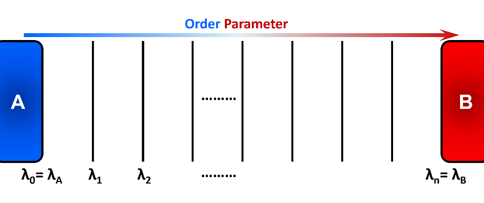
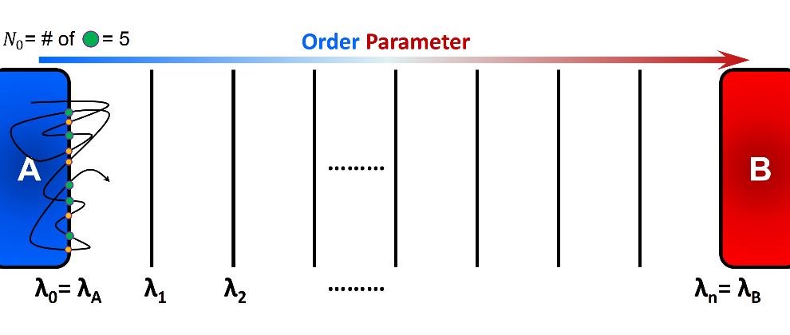
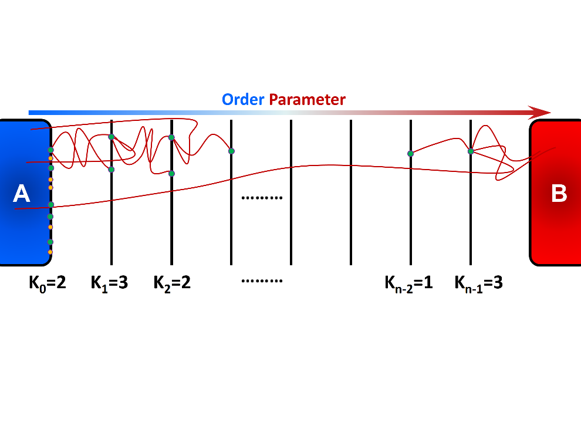

.. _Forward-flux:

Forward-Flux
------------

Forward Flux Sampling (FFS) is an enhanced sampling method to simulate “rare events” in
non-equilibrium and equilibrium systems. Several review
articles in the literature present a comprehensive perspective on the basics,
applications, implementations, and recent advances of FFS. Here, we provide a
brief general introduction to FFS, and describe the Rosenbluth-like variant of
forward flux method. We also explain various options and variables to setup 
and run an efficient FFS simulation using SSAGES.

Introduction
^^^^^^^^^^^^

Rare events are ubiquitous in nature. Important examples include crystal nucleation, 
earthquake formation, slow chemical reactions, protein conformational changes, 
switching in biochemical networks, and translocation through pores. The activated/rare 
process from a stable/metastable region A to a stable/metastable region B is characterized 
by a long waiting time between events, which is several orders of magnitude longer than 
the transition process itself. This long waiting time typically arises due to the presence 
of a large free energy barrier that the system has to overcome to make the transition 
from one region to another. The outcomes of rare events are
generally substantial and thereby it is essential to obtain a molecular-level
understanding of the mechanisms and kinetics of these events.
“Thermal fluctuations” commonly drives the systems from an initial state to a
final state over an energy barrier :math:`\Delta E`. The transition frequency
from state A to state B is proportional to :math:`e^{\frac{-\Delta E}{k_{B}T}}`,
where :math:`k_{B}T` is the thermal energy of the system. Accordingly, the time
required for an equilibrated system in state A to reach state B grows
exponentially (at a constant temperature) as the energy barrier :math:`\Delta E`
become larger. Eventually none or only a few transitions may occur within the
typical timescale of molecular simulations. In FFS method, several intermediate
states or so-called interfaces (:math:`\lambda_{i}`) are placed along a
“reaction coordinate” or an “order parameter” between the initial state A and
the final state B (Figure 1). These intermediate states are chosen such that the
energy barrier between adjacent interfaces are readily surmountable using
typical simulations. Using the stored configurations at an interface, several
attempts are made to arrive at the next interface in the forward direction (the
order parameter must change monotonically when going from A to B). This
incremental progress makes it more probable to observe a full transition path
from state A to state B. FFS uses positive flux expression to calculate rate
constant. The system dynamics are integrated forward in time and therefore
detailed balance is not required.

    In Forward Flux sampling method, several intermediate states are placed along 
    the order parameter to link the initial state A and the final state B. Incremental 
    progress of the system is recorded and analyzed to obtain relevant kinetic and thermodynamic
    properties.

Several protocols of forward flux method have been adopted in the literature to

1) generate the intermediate configurations,
2) calculate the conditional probability of reaching state B starting from
   state A, :math:`P(\lambda_{B} = \lambda_{n} | \lambda_{A} = \lambda_{0})`,
3) compute various thermodynamic properties, and
4) optimize overall efficiency of the method. The following are the widely-used
   variants of forward flux sampling method:

* Direct FFS (DFFS)
* Branched Growth FFS (BGFFS)
* Rosenbluth-like FFS (RBFFS)
* Restricted Branched Growth FFS (RBGFFS)
* FFS Least-Squares Estimation (FFS-LSE)
* FF Umbrella Sampling (FF-US) 

Rate Constant and Initial Flux
^^^^^^^^^^^^^^^^^^^^^^^^^^^^^^

The overall rate constant or the frequency of going from state A to state B is
computed using the following equation:

.. math::

    k_{AB} = \Phi_{A,0} \cdot P\left(\lambda_{N} \vert \lambda_{0}\right)

here, :math:`\Phi_{A,0}` is the initial forward flux or the flux at the initial
interface, and :math:`P\left(\lambda_{N} \vert \lambda_{0}\right)` is the
conditional probability of the trajectories that initiated from A and reached B
before returning to A. In practice, :math:`\Phi_{A,0}` can be obtained by
simulating a single trajectory in State A for a certain amount of time
:math:`t_{A}`, and counting the number of crossings of the initial interface
:math:`\lambda_{0}`. Alternatively, a simulation may be carried out around state
A for a period of time until :math:`N_{0}` number of accumulated
configurations is stored (this has been implemented in SSAGES):

.. math::

    \Phi_{A,0} = \frac{N_{0}}{t_{A}}

here, :math:`N_{0}` is the number of instances in which :math:`\lambda_{0}` is
crossed in forward direction, and :math:`t_{A}` is the simulation time that the system was run around
state A. Note that

1) :math:`\lambda_{0}` can be crossed in either forward
   (:math:`\lambda_{t} < \lambda_{0}`) or backward
   (:math:`\lambda_{t} > \lambda_{0}`) directions, but only "forward crossing"
   marks a checkpoint (see Figure 2) and
2) :math:`t_{A}` should only include the simulation time around state A and
   thereby the portion of time spent around state B must be excluded, if any. 

In general, the conditional probability is computed using the following expression:

.. math::

    P\left(\lambda_{n} \vert \lambda_{0}\right) =
    \prod\limits_{i=0}^{n-1} P\left(\lambda_{i+1} \vert \lambda_{i}\right) =
    P\left(\lambda_{1}\vert\lambda_{0}\right)\cdot P\left(\lambda_{2}\vert\lambda_{1}\right)
    \dots P\left(\lambda_{n}\vert\lambda_{n-1}\right)

:math:`P\left(\lambda_{i+1}\vert\lambda_{i}\right)` is computed by initiating a
large number of trials from the current interface and recording the number of
successful trials that reaches the next interface. The successful trials in
which the system reaches the next interface are stored and used as
checkpoints in the next interface. The failed trajectories that go all the way
back to state A are terminated. Different flavors of forward flux method use
their unique protocol to select checkpoints to initiate trials at a given
interface, compute final probabilities, create transitions paths, and analyze
additional statistics.

    A schematic representation of computation of initial flux using a single
    trajectory initiated in state A. The simulation runs for a certain period of
    time :math:`t_{A}` and number of forward crossing is recorded. Alternatively,
    we can specify the number of necessary checkpoints :math:`N_{0}` and run a
    simulation until desired number of checkpoints are collected. In this figure,
    green circles show the checkpoints that can be used to generate transition
    paths.

Rosenbluth-like Forward Flux Sampling (RBFFS)
^^^^^^^^^^^^^^^^^^^^^^^^^^^^^^^^^^^^^^^^^^^^^

Rosenbluth-like Forward Flux Sampling (RBFFS) method is an adaptation of
Rosenbluth method in polymer sampling to simulate rare events [4]_.
The RBFFS is comparable to Branched Growth Forward Flux (BGFFS) [1]_ [2]_ but,
in contrast to BGFFS, a single checkpoint is randomly selected at a non-initial
interface instead of initiation of trials from all checkpoints at a given
interface (Figure 3). In RBFFS, first a checkpoint at :math:`\lambda_{0}` is
selected and :math:`k_{0}` trials are initiated. The successful runs that reach
:math:`\lambda_{1}` are stored. Next, one of the checkpoints at :math:`\lambda_{1}` is randomly chosen (in
contrast to Branched Growth where all checkpoints are involved), and
:math:`k_{1}` trials are initiated to :math:`\lambda_{2}`. Last, this procedure
is continued for the following interfaces until state B is reached or all trials
fail. This algorithm is then repeated for the remaining checkpoints at
:math:`\lambda_{0}` to generate multiple “transition paths”.

    Rosenbluth-like Forward Flux Sampling (RBFFS) involves sequential generation
    of unbranched transition paths from all available checkpoints at the first
    interface :math:`\lambda_{0}`. A single checkpoint at the interface
    :math:`\lambda_{i > 0}`  is randomly marked and :math:`k_{i}` trials are
    initiated from that checkpoint which may reach to the next interface
    :math:`\lambda_{i+1}` (successful trials) or may return to state A (failed
    trial).

In Rosenbluth-like forward flux sampling, we choose one checkpoint from each
interface independent of the number of successes. The number of available
checkpoints at an interface are not necessarily identical for different
transition paths :math:`p`. This implies that more successful transition paths
are artificially more depleted than less successful paths. Therefore, we need to
enhance those extra-depleted paths by reweighting them during post-processing.
The weight of path :math:`p` at the interface :math:`\lambda_{i}` is given by:

.. math::

    w_{i,b} = \prod\limits_{j=0}^{i-1} \frac{S_{j,p}}{k_{j}}

where :math:`S_{j,p}` is the number of successes at the interface :math:`j` for
path :math:`p`. The conditional probability is then computed using the following
expression:

.. math::

    P\left(\lambda_{n}\vert\lambda_{0}\right) =
    \prod\limits_{i=0}^{n-1} P\left(\lambda_{i+1} \vert \lambda_{i}\right) =
    \frac{ \prod_{i=0}^{n-1}\sum_{p} w_{i,p} S_{i,p} / k_{i} }{ \sum_{p} w_{i,p} }

:math:`\Sigma` here runs over all transition paths in the simulation.

Options & Parameters
^^^^^^^^^^^^^^^^^^^^

The notation used in SSAGES implementation of the FFS is mainly drawn from Ref. [1]_.
We recommend referring to this review article if the user is unfamiliar with the terminology. 
To run a DFFS simulation using SSAGES, an input file in JSON format is required
along with a general input file designed for your choice of molecular dynamics
engine (MD engine). For your convenience, two files ``Template_Input.json`` and
``FF_Input_Generator.py`` are provided to assist you in generating the JSON
file. Here we describe the parameters and the options that should be set in
``Template_Input.json`` file in order to successfully generate an input file and
run a DFFS simulation.

Input and parameters related to "driver"
~~~~~~~~~~~~~~~~~~~~~~~~~~~~~~~~~~~~~~~~

type 
    + Type: string
    + Default:  “LAMMPS”
    + Functionality:  Defines the preferred MD engine to run the actual
      simulation. You are encouraged to read the documentation page of the
      corresponding MD package to learn about the input files and different options
      available to that package.   

number processors
    + Type: integer
    + Default: 1
    + Functionality:  Sets the number of processors that individual walkers
      use to run the simulation. In the current version of SSAGES, this should be set 
      to 1.

inputfile
    + Type: string
    + Default: ""
    + Functionality: Specifies the name of the engine-specific input file. The
      user is encouraged to refer to the documentation page of the corresponding
      MD package to learn about various input options as well as the structure
      and format of the input files suitable for their MD engine.

MDSteps
    + Type: integer
    + Default: 10000000
    + Functionality:  Sets the maximum number of MD steps allowed for a FFS
      simulation on a given walker. We recommend defining a large number here to
      ensure that the simulation is completed before reaching that many steps.
      SSAGES will exit upon completion of the FFS simulation.

logfile
    + Type: string
    + Default: “log”
    + Functionality: Sets the name of the output file that the MD engine
      uses to write the simulation information including timesteps, energies, etc.

Input and parameters related to "method"
~~~~~~~~~~~~~~~~~~~~~~~~~~~~~~~~~~~~~~~~

type
    + Type: string
    + Default: "ForwardFlux"
    + Functionality:  Instructs SSAGES to activate the “ForwardFlux” module.
      Do not change this if you plan to run a forward flux sampling simulation.

flavor
    + Type: string
    + Default: "DirectForwardFlux"
    + Functionality: Specifies the flavor of the FFS method that SSAGES should run.
      Currently, DFFS has been implemented in SSAGES. RBFFS and BGFFS will be available in the future releases.

nInterfaces
    + Type: integer
    + Default: 5
    + Functionality:  Sets the total number of interfaces that connects the initial state A to the final State B (including States A and B themselves)

interfaces
    + Type: array
    + Default: []
    + Functionality:  Defines an array of intermediate interfaces that links the
      initial state A to the final state B. This array can either be defined in
      the ``Template_Input.json`` file or ``FF_Input_Generator.py`` file. In the
      latter case, the values of **interfaces** is left blank in the
      ``Template_Input.json`` file. Minimum of two interfaces must be defined.

N0Target
    + Type: integer 
    + Default: 100
    + Functionality: Defines the number of the configurations that ought
      to be generated (or have been provided by user) at the first interface.  

trials
    + Type: array
    + Default: []
    + Functionality:  Specifies the number of trials that should be spawned from each 
      interface. The length of this array should match the length of the array of the "interfaces".

computeInitialFlux
    + Type: boolean
    + Default: "true"
    + Functionality:  Specifies whether a calculation of the initial flux should be performed or not. If this parameter is set to "true", SSAGES would also
      generate the user-specified number of initial configurations (N0Target). To compute the initial flux, user must provide an initial configuration in state A, otherwise SSAGES would issue an error. If this parameter is set to "false", the user must provide the necessary number of the initial configurations in separate files. The files name and the files content should follow a specific format. The format of the files name should be "l0-n<n>.dat" where <n> is the configuration number (i.e. 1, 2, 3, ..., N0Target). The first line of the configuration files includes three numbers "<l> <n> <a>", where <l> is the interface number (set to zero here), <n> is the configuration number, and <a> is the attempt number (set to zero here). The rest of the lines include the atoms IDs and their corresponding values of positions and velocities as "<atom ID> <x> <y> <z> <vx> <vy> <vz>" where <atom ID> is the ID of an atom, <x>, <y>, <z> are the coordinates of that atom, and <vx>, <vy>, and <vz> are the components of the velocity in the x, y, and z directions. Please note that the stored configurations at other interfaces would follow a similar format.       

saveTrajectories
    + Type: boolean
    + Default: "true"
    + Functionality: This flag determines if the FFS trajectories should be saved. Be advised that saving the trajectories of thousands of atoms 
      mandates large storage spaces.   

currentInterface
    + Type: integer 
    + Default: 0
    + Functionality: Specifies the interface in which the calculations should start from or should continue from. 
      This parameter is helpful in restarting a FFS calculation from interfaces other than State A. 

outputDirectoryName
    + Type: string
    + Default: "FFSoutput"
    + Functionality: Specifies the directory name that contains the output results of the FFS calculations including 
      the initial flux, the successful and failed configurations, commitor probabilities, and the trajectories. The output data related to the computation of the initial flux is stored in the file "initial_flux_value.dat", and the data related to the transition probabilities is stored in the file "commitor_probabilities.dat". 

Other required input parameters
~~~~~~~~~~~~~~~~~~~~~~~~~~~~~~~

CVs
    + Type: array
    + Default: none
    + Functionality: Selection of the "order parameter" or the "reaction coordinate".
      The current implementation of FFS in SSAGES can takes one collective
      variable.

.. _FFS_tutorial:

Tutorial
^^^^^^^^

This tutorial will walk you step by step through the user example provided with
the SSAGES source code that runs the forward flux method on a Langevin particle 
in a two-dimensional potential energy surface using LAMMPS. First, be sure you
have compiled SSAGES with LAMMPS. Then, navigate to the ``SSAGES/Examples/User/ForwardFlux``
subdirectory.  Now, take a moment to observe the ``in.LAMMPS_FF_Test_1d`` file to familiarize
yourself with the system being simulated.  

The next two files of interest are the ``Template_Input.json`` input file and the
``FF_Input_Generator.py`` script.  Both of these files can be modified in your
text editor of choice to customize the inputs, but for this tutorial, simply
observe them and leave them be. FF_Template.json contains all the information
necessary to fully specify one driver; FF_Input_Generator.py copies this
information a number of times specified within the FF_Input_Generator.py script (for this tutorial,
2 times). Issue the following command to generate the JSON input file:

.. code-block:: bash

    python FF_Input_Generator.py

You will produce a file called ``Input-2proc.json`` along with "in.LAMMPS_FF_Test_1d-0"
and "in.LAMMPS_FF_Test_1d-1". You can also open this file to verify for yourself that
the script did what it was supposed to do.  Now, with your JSON input and your SSAGES binary,
you have everything you need to perform a simulation.  Simply run:

.. code-block:: bash

    mpiexec -np 2 ./ssages Input-2proc.json

This should run a quick FFS calculation and generate the necessary output.

Developers
^^^^^^^^^^

Joshua Lequieu, Hadi Ramezani-Dakhel, Ben Sikora, Vikram Thapar.

References
^^^^^^^^^^

.. [1] R. J. Allen, C. Valeriani, P. R. ten Wolde, *Forward Flux Sampling for
       Rare Event Simulations*. J Phys-Condens Mat 2009, 21 (46).
       
.. [2] F. A. Escobedo, E. E. Borrero, J. C. Araque, *Transition Path Sampling
       and Forward Flux Sampling. Applications to Biological Systems*.
       J Phys-Condens Mat 2009, 21 (33).

.. [3] R. J. Allen, D. Frenkel, P. R. ten Wolde, *Forward Flux Sampling-Type
       Schemes for Simulating Rare Events: Efficiency Analysis*.
       J. Chem. Phys. 2006, 124 (19).

.. [4] M. N. Rosenbluth, A. W. Rosenbluth, *Monte-Carlo Calculation of the
       Average Extension of Molecular Chains*.
       J. Chem. Phys. 1955, 23 (2), 356-359.
